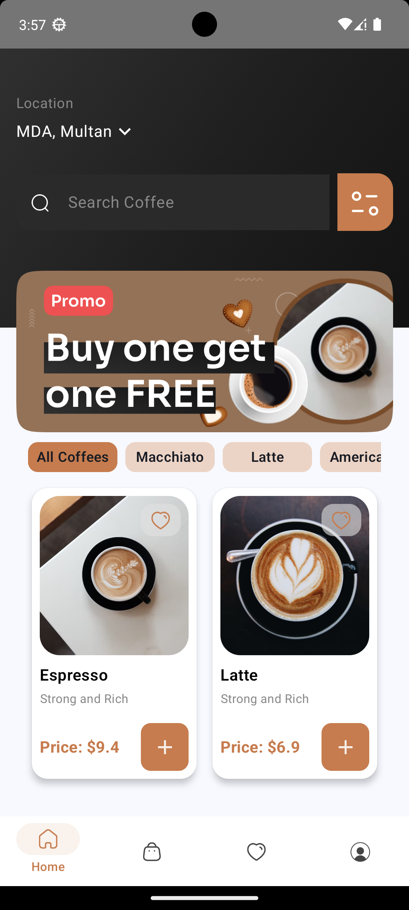
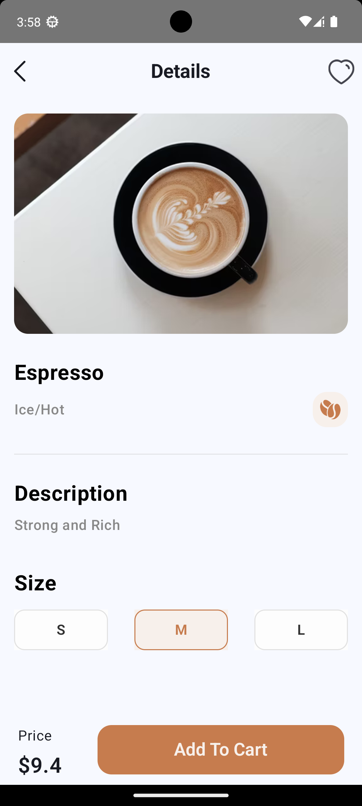
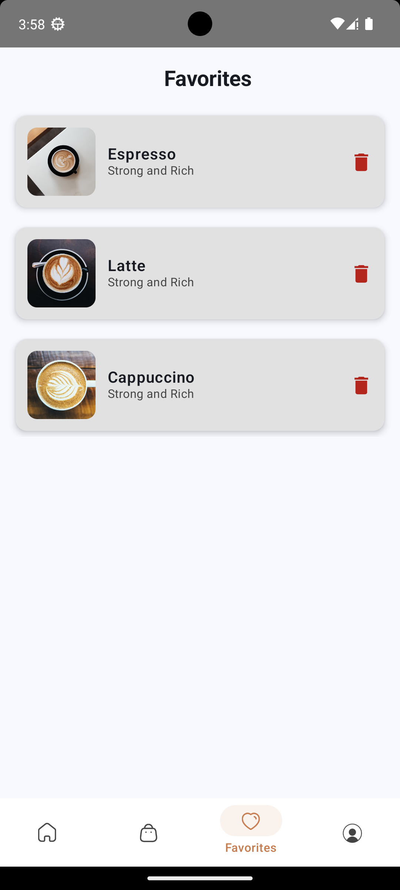
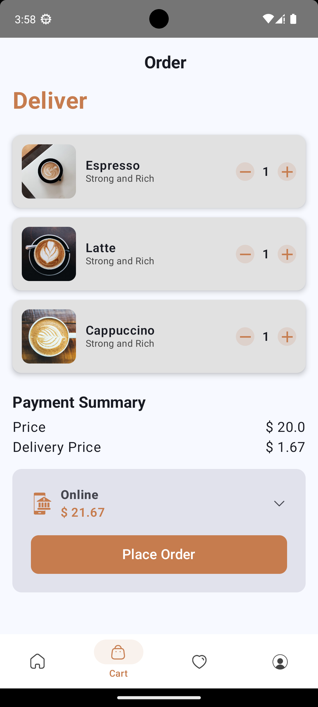
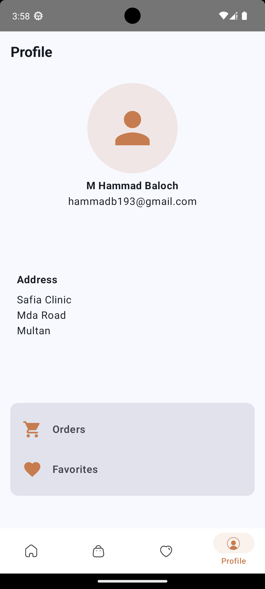

\# ☕ Compose Coffee App


A modern, beautifully designed Android coffee ordering application built entirely with \*\*Jetpack Compose\*\*. The app offers an intuitive UI flow for browsing beverages, customizing sizes, managing a shopping cart, selecting payment methods, and saving favorite drinks.


\---


\## 📱 App Screenshots


| Welcome Screen | Home Screen | Product Details |

| :---: | :---: | :---: |

|  |  |  |


| Favorites | Shopping Cart | Profile Screen |

| :---: | :---: | :---: |

|  |  |  |


\---


\## ✨ Key Features


\* 👋 \*\*Welcome Screen:\*\* Clean onboarding user interface.

\* 🏠 \*\*Home Screen:\*\* Product grid with search bar and category filter chips.

\* ☕ \*\*Product Details:\*\* Select beverage cup sizes (`SelectSizeChip`) and view item specs.

\* ❤️ \*\*Favorites:\*\* Easily bookmark and retrieve saved coffee items.

\* 🛒 \*\*Cart \& Checkout:\*\* Quantity adjustment and \*\*Payment Mode Selection\*\*.

\* 👤 \*\*Profile:\*\* User profile overview and app settings.


\---


\## 🛠️ Tech Stack


\* \*\*Language:\*\* \[Kotlin](https://kotlinlang.org/)

\* \*\*UI Framework:\*\* \[Jetpack Compose](https://developer.android.com/jetpack/compose)

\* \*\*Architecture:\*\* Declarative Component Architecture

\* \*\*Navigation:\*\* Jetpack Navigation for Compose


\---


\## 🚀 How to Run


1\. Clone the repository:

&#x20;  ```bash

&#x20;  git clone \[https://github.com/hammadb66/Compose\_Coffee\_App.git](https://github.com/hammadb66/Compose\_Coffee\_App.git)

